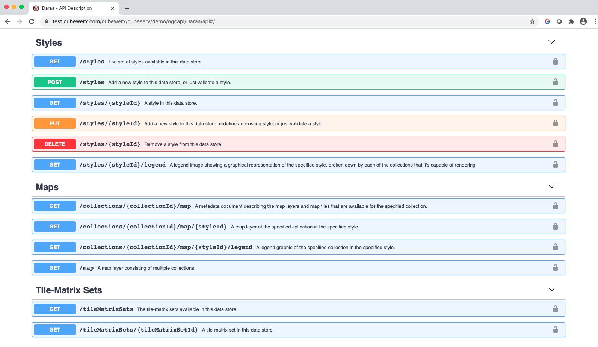

## Screenshots

This folder shows screenshots of implementations.

### UAB-CREAF / MiraMon

### CuberWerx

#### Maps API documentation

### OpenSphere (plug-in developed by Brad Hards)

#### Accessing CubeWerx Maps

#### Accessing GNOSIS Map Server (Daraa)

#### Accessing GNOSIS Map Server (Dynamic contours)

#### Accessing GNOSIS Map Server (Natural Earth)

### Ecere

#### Accessing CubeWerx Maps in GNOSIS Cartographer

#### GNOSIS Map Server

#### Vector bathymetry & elevation coverage (Natural Earth / ViewFinderPanoramas)

#### OrdnanceSurvey OpenMap Local (whole of Great Britain)

#### OrdnanceSurvey OpenMap Local (zoomed)

#### Dynamic contours generation (ViewFinderPanoramas)

#### Daraa (DTED & OpenStreetMap / NGA Topographic Data Store)

#### Daraa - night style (DTED & OpenStreetMap / NGA Topographic Data Store)

#### OpenStreetMap - Washington D.C.

#### OpenStreetMap - Washington D.C. (zoomed)

#### Virtual collection (ViewFinderPanoramas & Natural Earth)

#### OpenStreetMap - Ottawa - Map Tiles

#### OpenStreetMap - Ottawa - Map Tiles (next zoom level)

