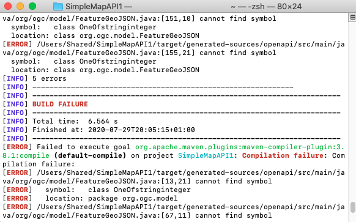
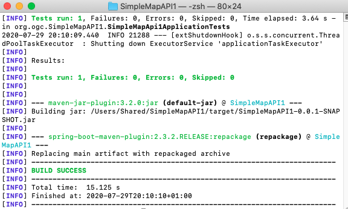

= Getting Started with Spring and OGC API - Maps
:source-highlighter: pygments

== Introduction

This Getting Started guide introduces Java developers that use Spring to working with API definition files from the draft OGC API - Maps specification. The guide is inspired by the https://reflectoring.io/spring-boot-openapi/[API-First Development with Spring Boot and Swagger] tutorial on reflectoring.io.

NOTE: The tutorial focuses on JSON and PNG responses only. However, OGC API - Maps can support any encoding.

To try out the application we built following this tutorial and using https://os.uk/business-government/products/open-zoomstack[OS Open Zoomstack] data, visit the following endpoints:

* Landing page (JSON) http://sandy-gh-1.ogc.org:8081
* Conformance declaration (JSON) http://sandy-gh-1.ogc.org:8081/conformance
* Collections http://sandy-gh-1.ogc.org:8081/collections
* Description of the os_open_zoomstack_subset collection http://sandy-gh-1.ogc.org:8081/collections/os_open_zoomstack_subset
* Description of a map from the os_open_zoomstack_subset collection with BBOX http://sandy-gh-1.ogc.org:8081/collections/os_open_zoomstack_subset/map
* A map from the os_open_zoomstack_subset collection with BBOX (*Contains OS data © Crown Copyright and database right 2020*) http://sandy-gh-1.ogc.org:8081/collections/os_open_zoomstack_subset/map/default?bbox=-0.12430460067838463,51.52024185677388,-0.08639925712829871,51.53989269334246&width=768&height=632&crs=CRS:84&f=image/png
* Description of a map from the roads_national collection http://sandy-gh-1.ogc.org:8081/collections/roads_national/map
* A map from the roads_national collection (*Contains OS data © Crown Copyright and database right 2020*) http://sandy-gh-1.ogc.org:8081/collections/roads_national/map/default?bbox=-0.2519995690005796,51.40755454013623,0.0072916659577137,51.61566708426387&width=768&height=632&crs=CRS:84&f=image/png

The default styling is from https://github.com/OrdnanceSurvey/OS-Open-Zoomstack-Stylesheets/tree/master/GeoPackage/Styled%20Layer%20Descriptors%20(SLD)

== Prerequisites

* The Java Development Kit (JDK) should be installed on your machine. You can use either http://openjdk.java.net[OpenJDK] or https://www.oracle.com/java/technologies/javase-downloads.html[Oracle JDK].
* https://maven.apache.org/[Maven] should be available on your machine.
* An Integrated Development Environment (IDE). Some popular ones include https://www.eclipse.org[Eclipse], https://netbeans.org[Apache Netbeans], https://code.visualstudio.com[Microsoft Visual Code] and https://www.jetbrains.com/idea/download/[IntelliJ IDEA Community edition].

[[step1]]
== Step 1 - Creating a basic Spring boot application

First create a basic spring boot application at http://start.spring.io

Let's call the project SimpleMapApi1.

Ensure that you select Spring Web as a dependency.

image::images/image1.png[width=601,height=389]

Download the project by clicking on the GENERATE button.

Notice that the project contains a class called `SimpleMapApi1Application`. This is the Main Class for the application.

Now configure the application to run to serve requests through port 8081 by adding `server.port=8081` to the file `/src/main/resources/application.properties`. In this tutorial we use port 8081, you could use any port you wish.

[[step2]]
== Step 2 - Adding the OpenAPITools Generator to the maven project

Add the following to the pom.xml file.

[source,xml]
----
<plugin>
   <groupId>org.openapitools</groupId>
   <artifactId>openapi-generator-maven-plugin</artifactId>
   <version>4.2.3</version>
   <executions>
      <execution>
         <goals>
            <goal>generate</goal>
         </goals>
         <configuration>
            <inputSpec>
               ${project.basedir}/src/main/resources/maps.yaml
            </inputSpec>
            <generatorName>spring</generatorName>
            <apiPackage>org.ogc.api</apiPackage>
            <modelPackage>org.ogc.model</modelPackage>
            <supportingFilesToGenerate>
               ApiUtil.java
            </supportingFilesToGenerate>
            <configOptions>
               <delegatePattern>true</delegatePattern>
            </configOptions>
         </configuration>
      </execution>
   </executions>
</plugin>

----

Then place the https://github.com/opengeospatial/OGC-API-Sprint-July-2020/blob/master/docs/Draft_Spring_Guide_for_OGC_API_Maps/maps.yaml[maps.yaml] file at `/src/main/resources/` in your maven project.

[[step3]]
== Step 3 - Adding supporting libraries to the project

We are next going to add a series of libraries to the pom.xml file. Some
of those libraries have the same version number, so to make it easier to
manage the version numbers we will add the version numbers to the
pom.xml file as properties. This is shown below.

[source,xml]
----
<properties>
<java.version>11</java.version>
…Additional properties go here…
</properties>
----

You will need to add the following libraries.

[source,xml]
----
<dependency>
   <groupId>org.springframework.boot</groupId>
   <artifactId>spring-boot-starter-validation</artifactId>
</dependency>
<dependency>
   <groupId>io.swagger</groupId>
   <artifactId>swagger-annotations</artifactId>
   <version>${swagger-annotations-version}</version>
</dependency>
<dependency>
   <groupId>org.openapitools</groupId>
   <artifactId>jackson-databind-nullable</artifactId>
   <version>${jackson-databind-nullable}</version>
</dependency>
<dependency>
   <groupId>com.fasterxml.jackson.jaxrs</groupId>
   <artifactId>jackson-jaxrs-base</artifactId>
   <version>${jackson-version}</version>
</dependency>
<dependency>
   <groupId>com.fasterxml.jackson.core</groupId>
   <artifactId>jackson-core</artifactId>
   <version>${jackson-version}</version>
</dependency>
<dependency>
   <groupId>com.fasterxml.jackson.core</groupId>
   <artifactId>jackson-annotations</artifactId>
   <version>${jackson-version}</version>
</dependency>
<dependency>
   <groupId>com.fasterxml.jackson.core</groupId>
   <artifactId>jackson-databind</artifactId>
   <version>${jackson-version}</version>
</dependency>
<dependency>
   <groupId>com.fasterxml.jackson.jaxrs</groupId>
   <artifactId>jackson-jaxrs-json-provider</artifactId>
   <version>${jackson-version}</version>
</dependency>
<dependency>
   <groupId>com.fasterxml.jackson.datatype</groupId>
   <artifactId>jackson-datatype-joda</artifactId>
   <version>${jackson-version}</version>
</dependency>
----

So the properties should look as follows.

[source,xml]
----
<properties>
   <java.version>11</java.version>
   <swagger-annotations-version>1.5.22</swagger-annotations-version>
   <jackson-version>2.10.2</jackson-version>
   <jackson-databind-nullable>0.2.1</jackson-databind-nullable>
</properties>
----

[[step4]]
== Step 4 - Building

Now compile the OpenAPI definition by running the command:

`$ mvn clean package`

This will generate a stub of the API. Due to a current limitation of
OpenAPITools Generator (see
https://github.com/OpenAPITools/openapi-generator/issues/5381) the
compilation fails to handle elements defined as ‘oneOf’ options. So, you
will see a compilation such as shown below.

As a workaround, create a class called OneOfstringinteger in the
org.ogc.model package.

image::images/image3.png[width=601,height=319]

Now re-compile the OpenAPI definition by running the command:

`$ mvn clean package`

If successful, you should arrive at a `BUILD SUCCESS` message.

[[step5]]
== Step 5 - Creating the Controller

At this point, you now have the API and model stub that you will need to
implement an interface that conforms to OGC API – Maps.

In the ‘target’ folder you will find a folder called ‘generated-sources’
that includes stubs for the API controllers and model.

image::images/image5.png[width=311,height=608]

The classes `CollectionsApi`, `ConformanceApi`, `DefaultApi`, and `MapApi`
contain the request mappings for each path specified in the OpenAPI
definition. These API stubs also have associated Controller classes
namely `CollectionsApiController`, `ConformanceApiController`,
`DefaultApiController`, and `MapApiController`.

So we next override the methods provided by the API classes
generated by the OpenAPITools Generator. Overriding these methods
enables us to add business logic to those methods.

So we create a class called `SimpleMapApi1Controller` to sit alongside the
`SimpleMapApi1Application` that was created by the initializr on
start.sprint.io in <<step1>>.

image::images/image6.png[width=362,height=306]

Next copy the stub of the `DefaultApi.getLandingPage` method into the
`SimpleMapApi1Controller` class. Then insert the following code inside the `SimpleMapApi1Controller.getLandingPage` method.

[source,java,linenums]
----

    LandingPage lp = new LandingPage();
    lp.setTitle("OGC API - Maps tutorial");
    lp.setDescription("An example of an implementation of OGC API - Maps using Spring.io");

    lp.addLinksItem(createLink("this document","self", "application/json",endpoint+"?f=json"));
    lp.addLinksItem(createLink("OGC API conformance classes implemented by this server","conformance","application/json",endpoint+"/conformance"));
    lp.addLinksItem(createLink("Access the data","data","application/json",endpoint+"/collections"));

    HttpHeaders headers = new HttpHeaders();
    headers.add("Content-Type", "application/json");
    ResponseEntity<LandingPage> re = new ResponseEntity<LandingPage>(lp, headers, HttpStatus.OK);
    return re;

----

Follow a similar approach of overriding the API methods generated by the OpenAPITools Generator. For example, for the conformance declaration you could override the `ConformanceAPI.getConformanceDeclaration` method using the following.

[source,java]
----

ConfClasses cc = new ConfClasses();
try {

    cc.addConformsToItem(new URI("http://www.opengis.net/spec/ogcapi-common-1/1.0/conf/core"));
    cc.addConformsToItem(new URI("http://www.opengis.net/spec/ogcapi-common-1/1.0/conf/collections"));
    cc.addConformsToItem(new URI("http://www.opengis.net/spec/ogcapi-maps-1/1.0/conf/core"));
    cc.addConformsToItem(new URI("http://www.opengis.net/spec/ogcapi-maps-1/1.0/conf/bbox"));

}
catch(java.lang.Exception ec)
{
    ec.printStackTrace();
}

HttpHeaders headers = new HttpHeaders();
headers.add("Content-Type", "application/json");
ResponseEntity<ConfClasses> re = new ResponseEntity<ConfClasses>(cc, headers, HttpStatus.OK);
return re;

----

Where the response is an image you could use the `ByteArrayResource` class provided by the Spring framework. For example, you could override the `CollectionsApi.getMapCollectionId` method to create a proxy for a GetMap operation offered by a Web Map Service (WMS) using the approach shown below.

[source,java]
----

    String urlString = "http://localhost:8080/geoserver/wms?service=WMS&" +
            "version=1.1.0&request=GetMap&layers="+collectionId+"&" +
            "bbox="+bbox.get(0)+"," +bbox.get(1)+"," +bbox.get(2)+"," +bbox.get(3)+"&" +
            "width="+width.intValue()+"&" +
            "height="+height.intValue()+"&" +
            "srs="+crs+"&" +
            "format="+f;

    BufferedImage bufferedImage = null;
    URL url = null;
    try {
        url = new URL(urlString);
        bufferedImage  = ImageIO.read(url);
    } catch (IOException e) {
        e.printStackTrace();
    }

    HttpHeaders headers = new HttpHeaders();
    headers.add("Content-Type","image/png");
    ByteArrayOutputStream byteArrayOutputStream = new ByteArrayOutputStream();
    try {
        ImageIO.write(bufferedImage , "png", byteArrayOutputStream);
    } catch (IOException e) {
        e.printStackTrace();
    }

    byte[] imageInByte = byteArrayOutputStream.toByteArray();

    ByteArrayResource bar = new ByteArrayResource(imageInByte);
    System.out.println("bar check");

    return ResponseEntity.ok()
            .contentType(MediaType.IMAGE_PNG)
            .body(bar);

}

----

[[step6]]
== Step 6 - Running the application

Once you are through overriding the other API methods, run the Spring boot application with the following command.

$ mvn spring-boot:run

Now using a client application such as Postman, send a request to http://localhost:8081 to see the landing page. The response should be something like.

[source,json]
----
{
    "title": "OGC API - Maps tutorial",
    "description": "An example of an implementation of OGC API - Maps using Spring.io",
    "links": [
        {
            "href": "http://localhost:8081?f=json",
            "rel": "self",
            "type": "application/json",
            "hreflang": null,
            "title": "this document",
            "length": null
        },
        {
            "href": "http://localhost:8081/conformance",
            "rel": "conformance",
            "type": "application/json",
            "hreflang": null,
            "title": "OGC API conformance classes implemented by this server",
            "length": null
        },
        {
            "href": "http://localhost:8081/collections",
            "rel": "data",
            "type": "application/json",
            "hreflang": null,
            "title": "Access the data",
            "length": null
        }
    ]
}
----

Next send a request to http://localhost:8081/conformance to see the conformance page. The response should be something like.

[source,json]
----
{
    "conformsTo": [
        "http://www.opengis.net/spec/ogcapi-common-1/1.0/conf/core",
        "http://www.opengis.net/spec/ogcapi-common-1/1.0/conf/collections",
        "http://www.opengis.net/spec/ogcapi-maps-1/1.0/conf/core",
        "http://www.opengis.net/spec/ogcapi-maps-1/1.0/conf/bbox"
    ]
}

----
